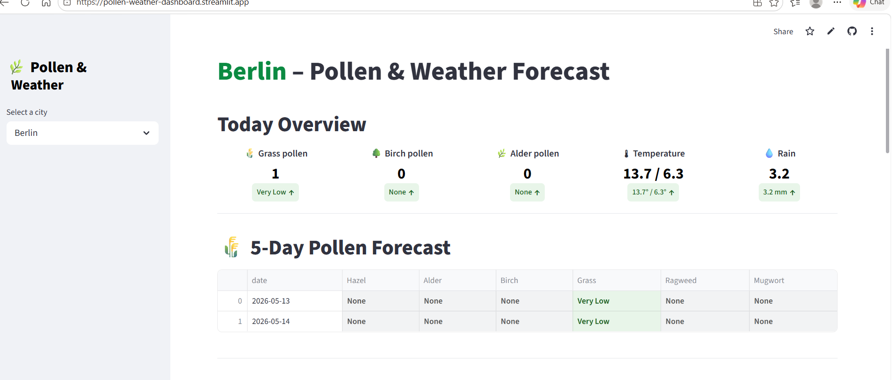

# 🌿 Pollen & Weather Dashboard – Germany  
A live Streamlit dashboard that combines **pollen forecast**, **weather forecast**, and **7‑day historical trends** for German cities.  
Built with Python, Streamlit, and real-time APIs.

  

<h1 align="center">🌿 Pollen & Weather Dashboard – Germany</h1>

🔗 **Live App:** https://pollen-weather-dashboard.streamlit.app  
-------------------------------------------------------------------------------------------------

🌟 **Why this project?  
Seasonal allergies affect millions in Germany. This dashboard helps users track pollen levels and weather conditions in real time, combining multiple APIs into one clean interface.

📍 **Location:** Germany  
👩‍💻 **Author:** Pavani Bandla  
🔗 **LinkedIn:** www.linkedin.com/in/pavani-bandla-893a76402

-----------------------------------------------------------------------------------------------------------

## 📸 Dashboard Preview

### 📅 7‑Day weather forecast

### 📊 Trend Charts

-------------------------------------------------------------------------------------------------

## 🚀 Features

- 🌼 **Live Pollen Forecast** (DWD API – Deutscher Wetterdienst)  
- ☀️ **Live Weather Forecast** (Meteo API)  
- 📊 **Trend Charts** (Pollen vs Temperature, Wind, Rain)  
- 📅 **7‑Day Historical Data** (auto‑updated daily)  
- 🎨 **Emoji‑based Weather Styling**  
- 🏙️ **City Selection** for personalized forecasts  
- 📈 **Clean, interactive Streamlit UI**

-------------------------------------------------------------------------------------------------

## 🧠 How It Works

### 1. **Pollen Data Scraping**
- Uses DWD’s official pollen forecast API  
- Extracts pollen levels for 2 days  
- Cleans & structures data into a dataframe  

### 2. **Weather Data Scraping**
- Uses Meteo API for 7‑day forecast  
- Extracts temperature, wind, rain, conditions  
- Applies emoji‑based styling for readability  

### 3. **7‑Day History**
- A daily script appends pollen + weather data  
- Stored in `combined_7days.csv`  
- Displayed as a trend chart in the dashboard  

### 4. **Dashboard**
- Built with Streamlit  
- Auto‑refreshes when new data is pushed  
- Hosted on Streamlit Cloud  

---

## 🛠️ Tech Stack

- **Python 3.10**  
- **Streamlit**  
- **Pandas**  
- **Requests**  
- **Matplotlib / Plotly**  
- **DWD Pollen API**  
- **Meteo Weather API**

---
## 📂 Project Structure
pollen_weather_project/
│
├── app.py                               # Streamlit dashboard
├── requirements.txt                      # Dependencies
├── dwd_pollen_5day.csv                   # Pollen forecast data
├── meteo_weather_5day.csv                # Weather forecast data
├── combined_7days.csv                    # 7-day history
│
├── scraping_pollen_weather_History.ipynb # Daily history scraper
├── pollen_and_weather_scraping.ipynb     # API + scraping logic
│
└── assets/
└── screenshots/                      # Dashboard images

-------------------------------------------------------------------------------------------------------------------

## ▶️ Run Locally
pip install -r requirements.txt
streamlit run app.py
-------------------------------------------------------------------------------------------------------------------

---

## 🔮 Future Enhancements

- 🌫️ Add Air Quality Index (AQI)  
- 🌓 Add Dark/Light Mode  
- ⚡ Add caching for faster load  
- 📍 Add city autocomplete  
- 📱 Add mobile‑friendly layout  
- 🔔 Add pollen alert notifications  

---

## 📜 License
This project is licensed under the **MIT License**.

---

## 💬 Contact
If you’d like to collaborate or discuss data projects:

📧 Email: *pavani.bandla25@gmail.com*  
🔗 LinkedIn: www.linkedin.com/in/pavani-bandla-893a76402

## 📂 Project Structure

